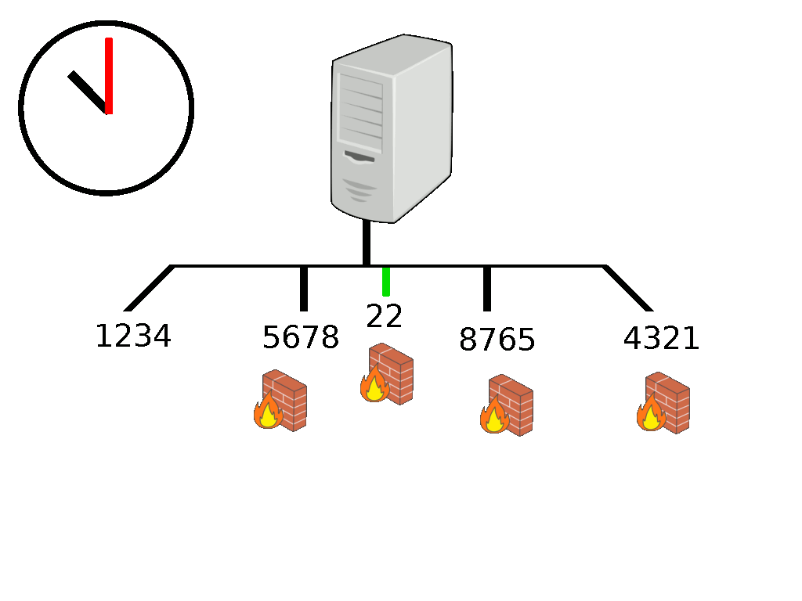
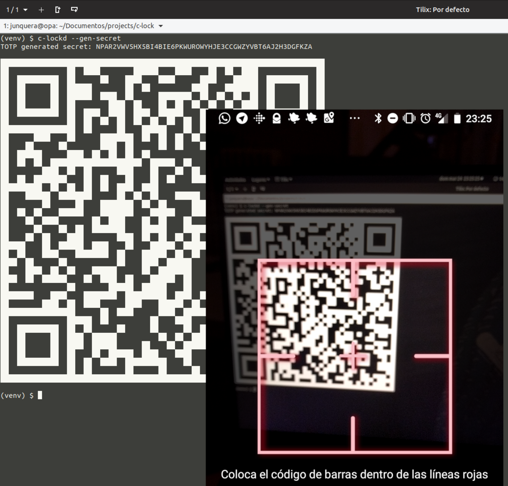
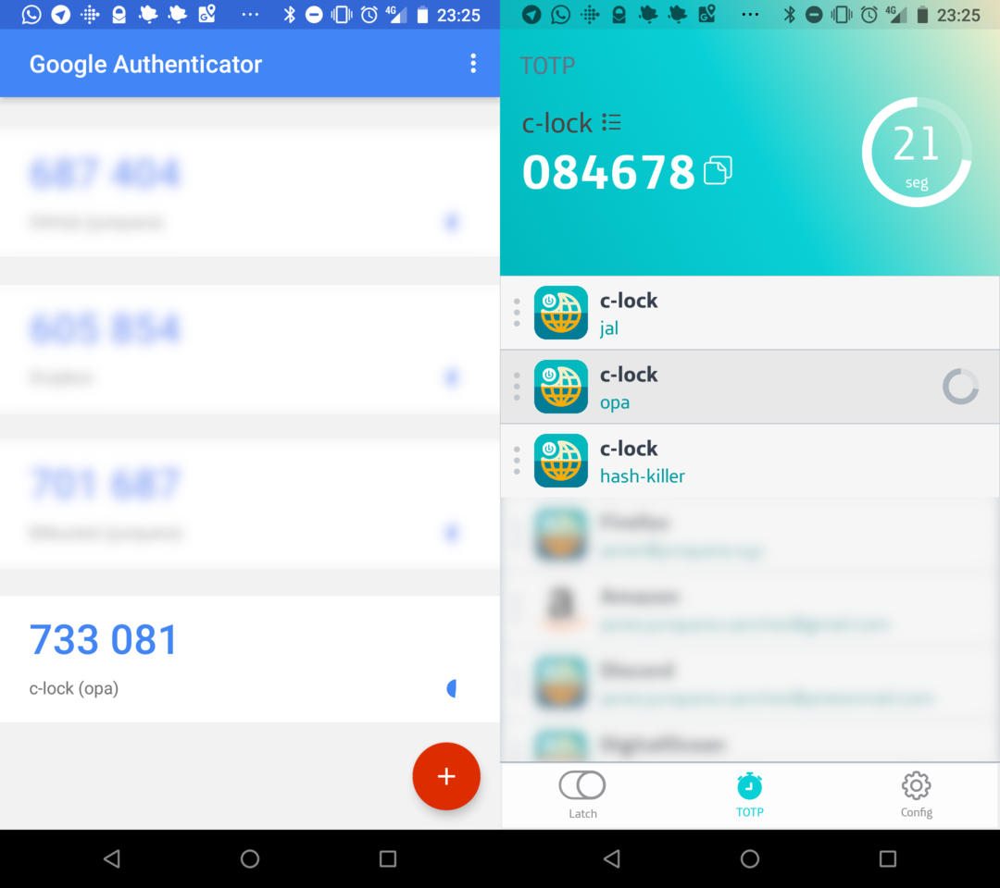

# c-lock

[](https://travis-ci.org/junquera/c-lock)
[](https://snyk.io/test/github/junquera/c-lock?targetFile=requirements.txt)
[](https://lgtm.com/projects/g/junquera/c-lock/alerts/)
[](https://lgtm.com/projects/g/junquera/c-lock/context:python)

A TOTP based port knocking service. Every time slot, it generates a sequence of ports that must be *knocked* (in a correct order) before the final port (it have been designed for protecting a SSH service) becames opened.

<!-- https://dashboard.moovly.com -->



> Yeah, I'm not very good with graphics...

## Table of Contents

<!-- Thanks https://github.com/jonschlinkert/markdown-toc -->

<!-- toc -->

- [Installation](#installation)
  * [System dependencies](#system-dependencies)
  * [Software dependencies](#software-dependencies)
- [Usage](#usage)
  * [Step 1 - Server setup](#step-1---server-setup)
  * [Step 2 - Setup 2fa applications](#step-2---setup-2fa-applications)
  * [Step 3 (server) - Start server side](#step-3-server---start-server-side)
  * [Step 3 (client) - Port knocking using TOTP pin](#step-3-client---port-knocking-using-totp-pin)
  * [Step 3 (client) - Port knocking using secret](#step-3-client---port-knocking-using-secret)
  * [Step 4 - Connect to your protected service =)](#step-4---connect-to-your-protected-service-)
  * [Server](#server)
  * [Client](#client)
- [Examples](#examples)
- [Contributing](#contributing)
- [Credits](#credits)

<!-- tocstop -->

## Installation

### System dependencies

This is the software with wich I have worked:

- `python 3.x`

- `iptables >= v1.6`

It has been tested in *Ubuntu 16.04* and *Debian 9*, but should work with any other system with theese systems installed.

### Software dependencies

As it is just an alpha version, it has no currently an automated installer, because until it comes debugged and improved, it shouldnt have yet integration with the system.

Because `python-cryptography` is needed for some dependencies, it must be installed before anything else: [Building cryptography on linux](https://cryptography.io/en/latest/installation/#building-cryptography-on-linux)

For install dependencies there are two options:

- **Option A**: [Pipenv](https://github.com/pypa/pipenv) (*Recommended*)

```bash
pip3 install pipenv
pipenv install -r requeriments.txt
```

- **Option B**: requeriments.txt

```bash
pip3 install -r requeriments.txt
```

## Usage

### Step 1 - Server setup

```shell
$ c-lockd --gen-secret
```



### Step 2 - Setup 2fa applications



### Step 3 (server) - Start server side

```shell
# For example, protecting SSH port
$ c-lockd --secret NPAR2VWV5HX5BI4BIE6PKWUROWYHJE3CCGWZYVBT6AJ2H3DGFKZA -p 22
```

### Step 3 (client) - Port knocking using TOTP pin

```shell
$ c-lock --address $SERVER_ADDRESS --pin 084678
```

### Step 3 (client) - Port knocking using secret

```shell
$ c-lock --address $SERVER_ADDRESS --secret NPAR2VWV5HX5BI4BIE6PKWUROWYHJE3CCGWZYVBT6AJ2H3DGFKZA
```

### Step 4 - Connect to your protected service =)

```shell
ssh $USER@$SERVER_ADDRESS
```

### Server

Must be launched as root (for managing the *iptables* rules):

```
usage: c-lockd [-h] [-ts SLOT] [-a ADDRESS] [-s SECRET] [-p PROTECTED_PORTS]
               [-o OPENED_PORTS] [--gen-secret] [--clean-firewall]
               [--log-level LOG_LEVEL]

Launch TOTP based port knocking protection

optional arguments:
  -h, --help            show this help message and exit
  -ts SLOT, --time-slot SLOT
                        Time slot for TOTP
  -a ADDRESS, --address ADDRESS
                        Address to protect
  -s SECRET, --secret SECRET
                        Secret part of TOTP
  -p PROTECTED_PORTS, --protected-ports PROTECTED_PORTS
                        Port which has to be protected
  -o OPENED_PORTS, --opened-ports OPENED_PORTS
                        Port which should be opened
  --gen-secret          Generate random secret
  --clean-firewall      Clean firewall configuration (e.g., after a bad close)
  --log-level LOG_LEVEL
                        Log level

```

### Client

```
usage: c-lock [-h] [-ts SLOT] -a ADDRESS [-s SECRET] [-p PIN] [-n PORTS]

Launch TOTP based port knocking protection

optional arguments:
  -h, --help            show this help message and exit
  -ts SLOT, --time-slot SLOT
                        Time slot for TOTP
  -a ADDRESS, --address ADDRESS
                        Address to knock
  -s SECRET, --secret SECRET
                        Secret part of TOTP
  -p PIN, --pin PIN     TOTP pin
  -n PORTS, --ports PORTS
                        Number of ports configured

```

## Examples

### Client

In this example:

1. Client scans server ports without c-lockd actived

2. When `c-lockd` is working in the server, just the opened ports can be scaned

3. Use `c-lock` with pin

4. The protected ports are now visible fron the client

[](https://asciinema.org/a/v3LV7Ss5VaSBvqtWe9VdPVSLV)

### Server

This is the server where the client points:

1. Generates the secret for the pin generation

2. Starts `c-lockd` server opening ports `80` and `5432`, and closing port `22`

3. When the client uses the correct port combination, it opens the protected port for 30 seconds

[](https://asciinema.org/a/z6O3qOZFCDDkQhnm3NkICOUYL)

## Contributing

By now, and until I finish a first stable version, I want to control the code. The best way of contribute to this project is apporting ideas and reviewing code. Any help is welcome!

For example, its obvious that I need help with documentation images, design, logo... :blush:

## Credits

- @ldx [python-iptables](https://github.com/ldx/python-iptables)

- @jonschlinkert [markdown-toc](https://github.com/jonschlinkert/markdown-toc)

- @mnooner256 [pyqrcode](https://github.com/mnooner256/pyqrcode)

## License

```
MIT License

Copyright (c) 2018 Javier Junquera Sánchez

Permission is hereby granted, free of charge, to any person obtaining a copy
of this software and associated documentation files (the "Software"), to deal
in the Software without restriction, including without limitation the rights
to use, copy, modify, merge, publish, distribute, sublicense, and/or sell
copies of the Software, and to permit persons to whom the Software is
furnished to do so, subject to the following conditions:

The above copyright notice and this permission notice shall be included in all
copies or substantial portions of the Software.

THE SOFTWARE IS PROVIDED "AS IS", WITHOUT WARRANTY OF ANY KIND, EXPRESS OR
IMPLIED, INCLUDING BUT NOT LIMITED TO THE WARRANTIES OF MERCHANTABILITY,
FITNESS FOR A PARTICULAR PURPOSE AND NONINFRINGEMENT. IN NO EVENT SHALL THE
AUTHORS OR COPYRIGHT HOLDERS BE LIABLE FOR ANY CLAIM, DAMAGES OR OTHER
LIABILITY, WHETHER IN AN ACTION OF CONTRACT, TORT OR OTHERWISE, ARISING FROM,
OUT OF OR IN CONNECTION WITH THE SOFTWARE OR THE USE OR OTHER DEALINGS IN THE
SOFTWARE.
```
